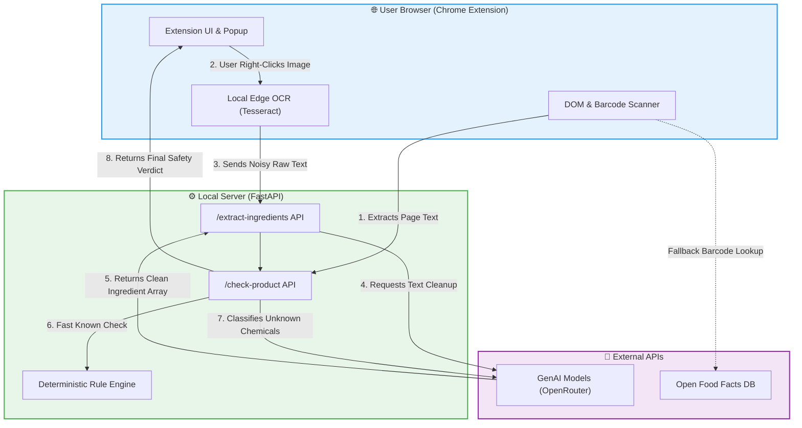

# AI-Powered Ingredient Label Checker - Architecture

This diagram illustrates the data flow and system components of the Ingredient Label Checker.

```mermaid
flowchart TD
    subgraph Browser["🌐 User Browser (Chrome Extension)"]
        UI["Extension UI & Popup"]
        OCR["Local Edge OCR (Tesseract)"]
        DOM["DOM & Barcode Scanner"]
    end

    subgraph Backend["⚙️ Local Server (FastAPI)"]
        API["/check-product API"]
        Clean["/extract-ingredients API"]
        Rules["Deterministic Rule Engine"]
    end

    subgraph External["🧠 External APIs"]
        LLM["GenAI Models (OpenRouter)"]
        OFF["Open Food Facts DB"]
    end

    %% Connections
    DOM -- "1. Extracts Page Text" --> API
    UI -- "2. User Right-Clicks Image" --> OCR
    OCR -- "3. Sends Noisy Raw Text" --> Clean
    
    Clean -- "4. Requests Text Cleanup" --> LLM
    LLM -- "5. Returns Clean Ingredient Array" --> Clean
    Clean --> API
    
    API -- "6. Fast Known Check" --> Rules
    API -- "7. Classifies Unknown Chemicals" --> LLM
    
    API -- "8. Returns Final Safety Verdict" --> UI
    
    DOM -. "Fallback Barcode Lookup" .-> OFF
    
    style Browser fill:#e3f2fd,stroke:#2196f3,stroke-width:2px
    style Backend fill:#e8f5e9,stroke:#4caf50,stroke-width:2px
    style External fill:#f3e5f5,stroke:#9c27b0,stroke-width:2px
```
